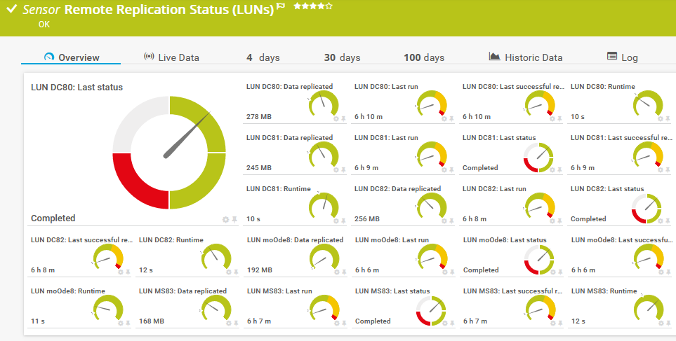
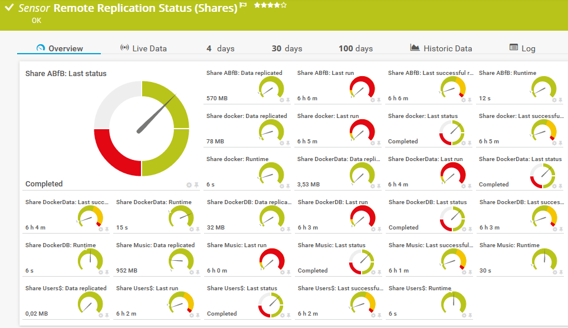

# nas_rep_status

Bash script for PRTG by Paessler to monitoring status of remote snashot replication.

The sensor will show the status and time passed since the last replication. The data is collected from */var/log/synolog/synodr.log*.

Sensor has to be created in PRTG on your Synology device.

Sensor tested on DS 918+ with DSM 7.2-64570.

This new version will also show the amount of replicated data.

### Prerequisites

Be sure you have set correct logon values for SSH in your device.

I personally use "Login via private key" with an user especially for monitoring which also may use sudo for this script without a password.


**HINT:** Since DSM 6.2.2 for SSH access the user has to be member of the local Administrators group on your Synology NAS.

### Installing

Place the script to /var/prtg/scriptsxml on your Synology NAS and make it executable. (You may have to create this directory structure because PRTG expects the script here.)

```
wget https://raw.githubusercontent.com/WAdama/nas_rep_status/master/nas_lun_rep_status.sh
or
wget https://raw.githubusercontent.com/WAdama/nas_rep_status/master/nas_share_rep_status.sh
chmod +x nas_lun_rep_status.sh / chmod +x nas_share_rep_status.sh
```

On your PRTG system place the file prtg.standardlookups.nas.repstatus.ovl in *INSTALLDIR\PRTG Network Monitor\lookups\custom* and refresh it under **System Administration / Administrative Tools**

In PRTG create under your device which represents your Synology a SSH custom advanced senor.

Choose under "Script" the script you need, nas_lun_rep_status.sh is for LUNs and nas_share_rep_status.sh is for shares. No configuration is needed, the script gets your replications from your system.

This script will set default values for limits in *Last run* and *Last successful replication* channel:

Upper warning limit: 36 h (129600 s)

Upper error limit: 60 h (216000 s)




